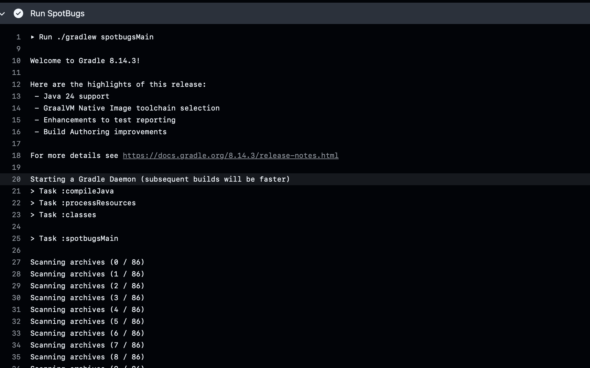
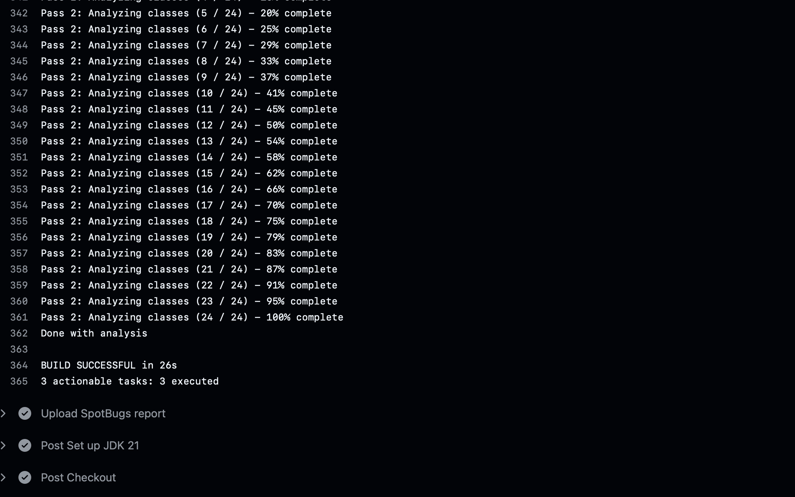
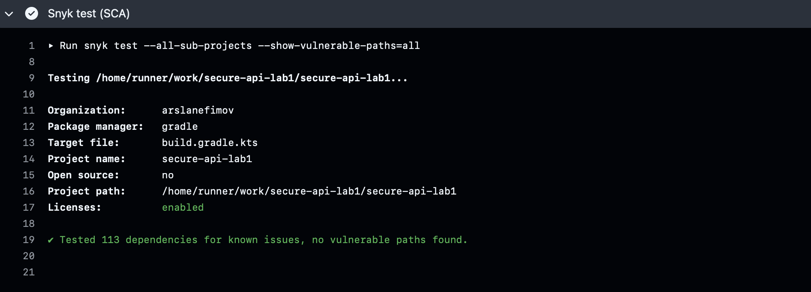

# Лабораторная работа №1

- **Выполнил студент** - `Ефимов Арслан Альбертович`
- **Группа** - `P3432`

## Описание проекта
___

Проект состоит из двух моделей - User и Order. Каждый пользователь 
может (будучи аутентифицированным) создать заказы, в которых указано наименование продукта,
цена, дата заказа, а также каждый пользователь может просмотреть свои заказы, сортированные по дате заказа.


## API
___

### 1. Authentication endpoints

- **URL:** - _**/secure-api/auth/sign-in**_  - Логин пользователя


- **Тело запроса:**

```json
{
  "login": "your-login",
  "password": "your-password"
}
```

- **Тело ответа:**

```json
{
    "token": "JWT",
    "username": "username",
    "message": "The user has successfully logged in",
    "timestamp": "2025-09-17T19:02:12.819508"
}
```

- **Описание - процесс логина пользователя в системе** 


- **URL:** - _**/secure-api/auth/sign-up**_  - Регистрация пользователя


- **Тело запроса:**

```json
{
  "login": "your-login",
  "password": "your-password"
}
```

- **Тело ответа:**

```json
{
  "token": "JWT",
  "username": "username",
  "message": "The user has successfully sign-up",
  "timestamp": "2025-09-17T19:45:38.542525"
}
```

- **Описание - Регистрация пользователя в системе** 

### 2. Order endpoints

- **URL:** - **GET** _**/secure-api/orders?page=0&size=10**_  - Получение заказов пользователя


- **Тело ответа:**

```json
{
  "content": [
    {
      "id": 10,
      "data": "2025-09-17T19:09:01.095392",
      "price": 4000.0,
      "productName": "&lt;script&gt;alert(&#39;XSS&#39;)&lt;/script&gt;"
    },
    {
      "id": 9,
      "data": "2025-09-17T19:03:44.359679",
      "price": 2000.0,
      "productName": "&amp;lt;script&amp;gt;alert(&amp;#39;XSS&amp;#39;)&amp;lt;/script&amp;gt;"
    },
    {
      "id": 8,
      "data": "2025-09-16T19:48:27.686549",
      "price": 34324.0,
      "productName": "tochonka"
    },
    {
      "id": 7,
      "data": "2025-09-14T21:30:51.859207",
      "price": 200.0,
      "productName": "ruchka"
    },
    {
      "id": 6,
      "data": "2025-09-14T21:29:10.242093",
      "price": 100.0,
      "productName": "tetrad"
    },
    {
      "id": 5,
      "data": "2025-09-14T21:28:42.286448",
      "price": 12000.0,
      "productName": "stul"
    },
    {
      "id": 4,
      "data": "2025-09-14T16:57:21",
      "price": 5000.0,
      "productName": "iphone"
    },
    {
      "id": 3,
      "data": "2025-09-14T13:16:15",
      "price": 2000.0,
      "productName": "divan"
    }
  ],
  "page": {
    "size": 10,
    "number": 0,
    "totalElements": 8,
    "totalPages": 1
  }
}
```

- **Описание - Получение заказов пользователя**

- **URL:** - **POST** _**/secure-api/orders**_ 
- 
- **Тело запроса:**

```json
{
    "price": 4000,
    "productName": "book"
}
```

- **Тело ответа:**

```json
{
    "id": 10,
    "data": "2025-09-17T19:09:01.095392",
    "price": 4000.0,
    "productName": "book"
}
```

- **Описание - Создание заказа пользователя**

___

### Описание реализованных мер защиты:
___

1. **Защита от SQL инъекций реализуется уже самой Spring Data JPA, так как он использует параметризированные 
запросы (Prepared Statements).**
2. **Защита от XSS реализована следующим образом:**

   - В строковых полях таких как `userame` используется Constraint валидация с помощью аннотаций `@NotBlank`, `@Pattern`
   - В строковых полях заказа `productName`, которые возвращаются в ответах, используется `HtmlUtils.htmlEscape()` для экранихации HTML
   - В не строковых полях происходит десериализация из JSON в поля объекта

### Реализация аутентификации:

- После процесса регистрации или входа пользователя ему выдается `JWT`, который 
в последующем будет служить идентификацией пользователя

- Для проверки подлинности есть различные фильтры для `JWT`, которые проверяет его структуру и время жизни
- Секретный ключ хранится в переменной окружения
- Все пароли хранятся в защищенном виде, хэшируются с помощью `BCryptPasswordEncoder()`


### Скриншоты отчетов SAST/SCA из раздела "Actions" / "CI/CD"






**Ссылка на последний успешный pipeline** - [pipeline](https://github.com/ArslanEfimov/secure-api-lab1/actions/runs/17804164347)